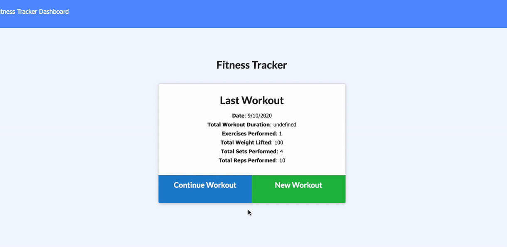

# Unit 17 Nosql Homework: Workout Tracker
[Live Demo on Heroku](https://davenelson-burger-logger.herokuapp.com/)




For this assignment, you'll create a workout tracker. You have already been provided with the front end code in the `Develop` folder. This assignment will require you to create Mongo database with a Mongoose schema and handle routes with Express.

## User Story

-   As a user, I want to be able to view create and track daily workouts. I want to be able to log multiple exercises in a workout on a given day. I should also be able to track the name, type, weight, sets, reps, and duration of exercise. If the exercise is a cardio exercise, I should be able to track my distance traveled.

## Business Context

A consumer will reach their fitness goals quicker when they track their workout progress.

## Acceptance Criteria

When the user loads the page, they should be given the option to create a new workout, or continue with their last workout.

The user should be able to:

-   Add exercises to a previous workout plan.

-   Add new exercises to a new workout plan.

-   View multiple the combined weight of multiple exercises on the `stats` page.

## Submission on BCS

You are required to submit the following:

-   The URL to the deployed application

-   The URL to the Github repository

## Hint: Use a virtual property

In `public/workout.js`, you can see that the frontend is expecting the objects in a response from your API to be objects that contain a `day`, `totalDuration`, and `exercises` property.

```javascript
// code from public/workout.js
async function initWorkout() {
    const lastWorkout = await API.getLastWorkout();
    console.log('Last workout:', lastWorkout);
    if (lastWorkout) {
        document.querySelector("a[href='/exercise?']").setAttribute('href', `/exercise?id=${lastWorkout._id}`);

        /** LOOK HERE */
        const workoutSummary = {
            date: formatDate(lastWorkout.day),
            totalDuration: lastWorkout.totalDuration,
            numExercises: lastWorkout.exercises.length,
            ...tallyExercises(lastWorkout.exercises),
        };

        renderWorkoutSummary(workoutSummary);
    } else {
        renderNoWorkoutText();
    }
}
```

The `day` and `exercises` properties are given in the starter documents generated by `seeders/seed.js`, but `totalDuration` doesn't show up anywhere in the code! What gives?

Mongoose can dynamically add new properties that derive from fields in your Mongo documents. Such a property is called **virtual property**. See [the docs](https://mongoosejs.com/docs/tutorials/virtuals.html) for information on how you can add the `totalDuration` property to new seed objects.
